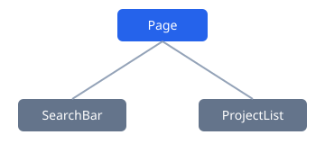

# Sample theory: lift state

## Bản chất

Hai component cần dùng chung dữ liệu thì state phải đặt ở component cha chung gần nhất.



## Code mẫu

```jsx title="ProjectsPage.jsx" showLineNumbers {4}
import { useState } from "react";

export function ProjectsPage({ projects }) {
  const [query, setQuery] = useState("");
  return <SearchBar value={query} onChange={setQuery} />;
}
```

## Thay đổi so với bản sai

```diff
- function SearchBar() {
-   const [query, setQuery] = useState('');
+ function SearchBar({value, onChange}) {
```

## Nuance

- Controlled input: `value` và `onChange` đến từ cha.
- Uncontrolled input: DOM tự giữ giá trị.

## AI Fluency

Khi AI đề xuất dùng global store cho state chỉ của một trang, cần kiểm tra lại phạm vi state trước khi chấp nhận.

## Requirement Thinking

Trước khi code: filter có cần giữ lại sau khi reload trang không?
